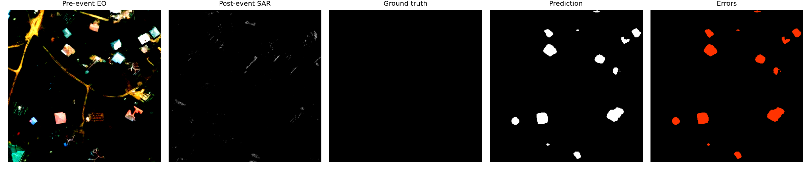
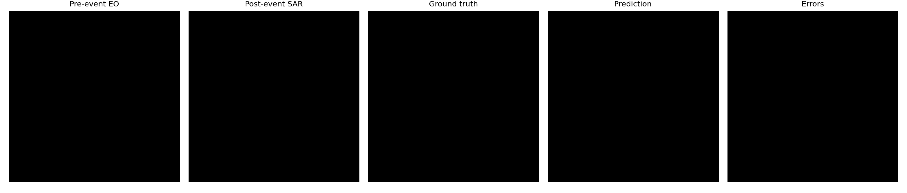
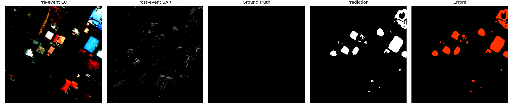
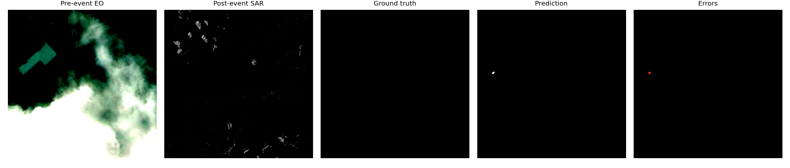
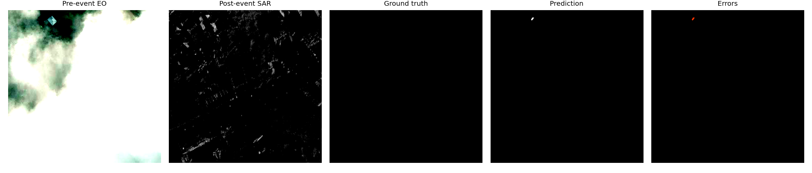

# Binary Change Detection on EO-SAR Image Pairs

## 1. Abstract

This report describes an end-to-end approach for binary pixel-level change detection on paired Electro-Optical (EO) and Synthetic Aperture Radar (SAR) imagery. The objective is to classify each pixel as no-change or change using the provided fixed train, validation, and test splits. The original four annotation classes are remapped exactly as specified in the assignment: background and intact pixels are treated as no-change, while damaged and destroyed pixels are treated as change. No external remote-sensing imagery is used for training or fine-tuning.

The final submitted system is a multi-task late-fusion U-Net. The pre-event RGB EO image is processed by an ImageNet-pretrained ResNet-34 encoder, while the post-event single-channel SAR image is processed by an ImageNet-pretrained ResNet-18 encoder adapted to one input channel. Decoder skip connections fuse EO and SAR features at multiple spatial scales. The model has two output heads: a binary change head for the assignment target and an auxiliary four-class head for background, intact, damaged, and destroyed supervision. The auxiliary head is included to preserve building damage semantics during training instead of collapsing all classes at the beginning of optimization.

The best validation result was obtained with full-image tiled inference and threshold sweeping. The binary head achieved validation IoU 0.4968, precision 0.7602, recall 0.5891, and F1 0.6638 at threshold 0.80. The four-class head remapped to binary achieved validation IoU 0.4907, precision 0.6600, recall 0.6567, and F1 0.6583 at threshold 0.70. However, the provided test scenes showed a large drop: using the validation-selected multiclass threshold 0.70 produced test IoU 0.0241 and F1 0.0471. A diagnostic test threshold sweep reached IoU 0.0661 at threshold 0.30, indicating severe probability calibration shift on unseen scenes rather than complete absence of learned change cues. The main limitation of the current solution is therefore cross-event generalization from training/validation scenes 01-08 to test scenes 09-10.

## 2. Literature Survey

Change detection in remote sensing has a long classical history. Traditional approaches include image differencing, image ratioing, change vector analysis, thresholding, and hand-designed post-processing. These methods are attractive because they are interpretable and inexpensive, but they are sensitive to illumination differences, registration error, seasonal variation, speckle, viewing geometry, and sensor mismatch. These weaknesses are particularly important for EO-SAR change detection because the two modalities measure different physical phenomena: EO imagery captures visible reflectance and texture, while SAR captures microwave backscatter and geometric scattering behavior.

Fully convolutional neural networks reframed change detection as dense prediction. U-Net is a strong baseline for this task because the encoder captures semantic context and the decoder recovers spatial detail through skip connections. This is important for building damage mapping, where changed regions are often small, fragmented, and boundary-sensitive. ResNet backbones further improve representation learning by providing stable pretrained feature extractors and deeper semantic features.

Siamese fully convolutional networks are widely used in remote-sensing change detection. Daudt et al. proposed early-fusion, concatenation, and feature-difference Siamese variants for bitemporal imagery. These methods motivated later architectures that compare learned feature representations instead of raw pixels. SNUNet-CD introduced dense Siamese skip connections to improve multi-scale feature reuse. STANet used spatial-temporal attention to compare bitemporal representations more effectively. Transformer-based methods, including BIT and ChangeFormer-style designs, further improved global context modelling and long-range interaction between image pairs.

This assignment differs from standard optical-optical bitemporal change detection because the pre-event image is EO and the post-event image is SAR. A simple shared-weight Siamese encoder assumes that both branches should use the same low-level filters, which is natural for same-sensor imagery but less appropriate for EO-SAR pairs. EO and SAR have different noise, contrast, texture, and physical interpretation. For this reason, I prioritized dual-encoder fusion: one encoder learns EO-specific features and the other learns SAR-specific features before decoder-level fusion.

The BRIGHT dataset paper and associated codebase are relevant because the original labels distinguish background, intact, damaged, and destroyed regions. Although the assignment evaluates a binary remapping, preserving the original four classes during training can help the model separate intact buildings from damaged or destroyed structures. This motivated the multi-task design used here: a binary head optimizes the assignment target, while an auxiliary four-class head provides richer damage supervision.

The main prior directions considered were:

- U-Net and ResNet-U-Net as reliable dense segmentation baselines.
- FC-Siam-Diff and Siamese U-Net for feature-difference change detection.
- SNUNet-CD for dense multi-scale Siamese fusion.
- STANet for spatial-temporal attention.
- BIT and ChangeFormer-style transformer models for global comparison.
- BRIGHT-style multi-class damage supervision for building damage assessment.

For this submission, I selected a reproducible CNN-based multi-task fusion architecture rather than a heavier transformer model. The dataset is imbalanced, the visible test split is small, compute is limited, and the assignment emphasizes clear reasoning and reproducibility in addition to final scores.

References consulted:

- Ronneberger, Fischer, and Brox, "U-Net: Convolutional Networks for Biomedical Image Segmentation", MICCAI 2015.
- He, Zhang, Ren, and Sun, "Deep Residual Learning for Image Recognition", CVPR 2016.
- Daudt, Le Saux, and Boulch, "Fully Convolutional Siamese Networks for Change Detection", ICIP 2018.
- Chen and Shi, "A Spatial-Temporal Attention-Based Method and a New Dataset for Remote Sensing Image Change Detection", Remote Sensing 2020.
- Chen, Qi, and Shi, "Remote Sensing Image Change Detection with Transformers", IEEE TGRS 2022.
- Bandara and Patel, "A Transformer-Based Siamese Network for Change Detection", IGARSS 2022.
- Fang et al., "SNUNet-CD: A Densely Connected Siamese Network for Change Detection of VHR Images", IEEE GRSL 2022.
- BRIGHT building damage assessment dataset paper, Earth System Science Data, 2025.
- PyTorch and torchvision documentation/code for ImageNet-pretrained ResNet backbones.

## 3. Methodology

### 3.1 Data Understanding

Each sample contains three co-registered TIFF files:

| Component | Description | Shape |
| --- | --- | --- |
| Pre-event image | RGB EO image | `1024 x 1024 x 3` |
| Post-event image | single-channel SAR image | `1024 x 1024 x 1` |
| Target | pixel-level damage mask | `1024 x 1024 x 1` |

The assignment requires the following binary label remapping:

| Original value | Original class | Remapped value | Remapped class |
| ---: | --- | ---: | --- |
| 0 | Background | 0 | No-change |
| 1 | Intact | 0 | No-change |
| 2 | Damaged | 1 | Change |
| 3 | Destroyed | 1 | Change |

The implementation applies this remapping as `mask >= 2`. The same remapping is used for training, validation, test evaluation, distribution reporting, and visualizations.

The exact binary class distributions are:

| Split | Samples | No-change pixels | Change pixels | Change fraction | Implied positive weight |
| --- | ---: | ---: | ---: | ---: | ---: |
| Train | 2781 | 2,870,320,706 | 45,769,150 | 1.57% | 62.71 |
| Validation | 334 | 342,518,211 | 7,706,173 | 2.20% | 44.45 |
| Provided test | 77 | 80,131,158 | 609,194 | 0.75% | 131.54 |

The original four-class distributions are:

| Split | Background | Intact | Damaged | Destroyed |
| --- | ---: | ---: | ---: | ---: |
| Train | 84.997% | 13.433% | 0.503% | 1.066% |
| Validation | 83.935% | 13.865% | 0.557% | 1.644% |
| Provided test | 93.543% | 5.703% | 0.135% | 0.620% |

The split composition is also important:

| Split | Scene IDs |
| --- | --- |
| Train | 01, 02, 03, 04, 05, 06, 07, 08 |
| Validation | 01, 02, 03, 04, 05, 06, 07, 08 |
| Provided test | 09, 10 |

This reveals a major evaluation challenge. The validation split shares scene IDs with the training split, while the provided test split contains unseen scenes. Therefore, validation performance is not a fully reliable estimate of cross-event generalization. The provided test split also has a much lower change fraction than validation, which makes false positives and calibration errors more damaging to IoU.

### 3.2 Preprocessing

EO images are converted to floating point values in `[0, 1]` and normalized using ImageNet RGB statistics. SAR images are converted to floating point values in `[0, 1]` and normalized with an approximate mean of 0.5 and standard deviation of 0.5. The EO and SAR tensors are concatenated into a four-channel input tensor. The binary mask is returned as a float tensor of shape `1 x H x W`, and the original four-class mask is returned as a long tensor of shape `H x W` for the auxiliary task.

All triplets are matched exactly by filename across `pre-event`, `post-event`, and `target` folders. The dataloader validates channel counts and image-mask spatial consistency. This check is important because a mismatched triplet would silently corrupt pixel-level supervision.

### 3.3 Architecture

The final model is a multi-task late-fusion U-Net:

- EO encoder: ImageNet-pretrained ResNet-34.
- SAR encoder: ImageNet-pretrained ResNet-18 with the first convolution adapted from three channels to one channel.
- Decoder: U-Net-style upsampling decoder with multi-scale skip fusion.
- Binary head: one-channel logits for no-change/change segmentation.
- Four-class head: four-channel logits for background/intact/damaged/destroyed segmentation.

The EO and SAR streams are kept separate until feature fusion. This is intentional because EO and SAR have different low-level statistics and physical meanings. Shared-weight Siamese encoders are more natural for same-sensor bitemporal imagery; for EO-SAR imagery, a pseudo-Siamese or dual-encoder design is more appropriate.

The auxiliary four-class head is motivated by the original annotation structure. Even though the assignment evaluates a binary mask, damaged and destroyed regions are not the only important distinction: the model must also avoid confusing intact buildings with damaged buildings. Multi-task training encourages this separation before final binary remapping.

### 3.4 Training Strategy

Training uses random crop-based optimization rather than full-image training. The configured crop sizes are selected per epoch from:

```text
320 x 320, 384 x 384, 448 x 448
```

This choice was made for three reasons. First, full `1024 x 1024` training would require a very small batch size on a Tesla T4. Second, the change class is sparse, and random crops with foreground-aware sampling expose the model to changed pixels more frequently. Third, multi-scale crops improve robustness to object scale and tile boundary effects.

Validation and test evaluation are performed on full images using tiled inference:

```text
tile_size = 384
tile_stride = 384
```

The best checkpoint is selected using full-image tiled validation and threshold sweeping. This avoids a common mistake in patch-based segmentation: selecting the best checkpoint on cropped validation while reporting full-image test inference.

The final training configuration is:

| Setting | Value |
| --- | --- |
| Model | Multi-task late-fusion U-Net |
| Input channels | 4 |
| Crop sizes | 320, 384, 448 |
| Epochs | 45 |
| Batch size | 8 |
| Optimizer | AdamW |
| Learning rate | 0.0001 |
| Weight decay | 0.025 |
| Scheduler | Cosine annealing |
| Mixed precision | Enabled |
| Gradient clipping | 1.0 |
| Dropout | 0.40 |
| Validation frequency | Every 2 epochs |
| Checkpoint metric | Best full-image validation IoU after threshold sweep |

### 3.5 Loss Function

The training objective combines binary and four-class supervision:

- Binary BCE-Dice loss for the assignment target.
- Four-class cross-entropy loss for original semantic labels.
- Foreground multi-class Dice loss over intact, damaged, and destroyed classes.
- Consistency loss between the binary head probability and the four-class head remapped probability.

The configured weights are:

| Loss component | Weight |
| --- | ---: |
| Binary loss | 0.35 |
| Four-class cross-entropy | 0.45 |
| Four-class foreground Dice | 0.20 |
| Binary/four-class consistency | 0.03 |

Within the binary loss, BCE and Dice are weighted as:

| Binary sub-loss | Weight |
| --- | ---: |
| BCE | 0.40 |
| Dice | 0.60 |

The raw train-set positive weight is approximately 62.71, but using such a large value made the model overly positive in earlier experiments. The final configuration uses a conservative `pos_weight = 4.0`. This still compensates for rare change pixels, but avoids forcing the model to predict change too aggressively.

Four-class weights are:

```text
[0.08, 0.35, 3.00, 2.50]
```

These weights down-weight the dominant background class and emphasize damaged/destroyed classes without completely ignoring intact buildings.

### 3.6 Augmentation

The final augmentations are:

- Horizontal flips.
- Vertical flips.
- Random 90-degree rotations.
- EO grayscale conversion with probability 0.30.
- EO brightness/contrast jitter with probability 0.50.
- EO channel shuffle with probability 0.05.
- SAR multiplicative speckle augmentation with probability 0.60.
- Foreground-aware crop sampling with probability 0.20.

Geometric augmentations are applied consistently to EO, SAR, and masks. EO appearance augmentations are applied only to EO channels. SAR speckle augmentation is applied only to SAR channels. This distinction is important because EO and SAR noise models are different.

### 3.7 Experiments and Design Decisions

Several architectures and training choices were considered:

- Early-fusion ResNet-U-Net: simple and efficient, but forces one encoder to process both EO and SAR statistics.
- Late-fusion U-Net: stronger modality separation and a stable baseline.
- Shared Siamese U-Net: regularizes the model, but assumes EO and SAR can share low-level filters.
- Gated feature-difference U-Net: explicitly models EO-SAR feature disagreement, but did not solve the test-domain calibration issue.
- Multi-task late-fusion U-Net: retained separate modality encoders and preserved four-class damage semantics during training.

The final choice was the multi-task late-fusion U-Net because it gave the best validation behavior while being computationally feasible on Kaggle T4 hardware. The most important engineering change was selecting checkpoints using full-image tiled validation rather than crop-only validation.

## 4. Results

All metrics are computed for the change class (`label = 1`). The confusion matrix format is:

```text
[[TN, FP],
 [FN, TP]]
```

The metrics are:

```text
IoU       = TP / (TP + FP + FN)
Precision = TP / (TP + FP)
Recall    = TP / (TP + FN)
F1        = 2 * Precision * Recall / (Precision + Recall)
```

### 4.1 Validation Results

The binary head achieved the best validation IoU:

| Head | Threshold | IoU | Precision | Recall | F1 | Confusion matrix |
| --- | ---: | ---: | ---: | ---: | ---: | --- |
| Binary head | 0.80 | 0.4968 | 0.7602 | 0.5891 | 0.6638 | `[[341086557, 1431654], [3166295, 4539878]]` |
| Four-class head remapped to binary | 0.70 | 0.4907 | 0.6600 | 0.6567 | 0.6583 | `[[339910778, 2607433], [2645685, 5060488]]` |

The four-class head is slightly lower in validation IoU but has better recall. The binary head is more conservative and gives higher precision. This difference is useful during analysis because the two heads reveal different calibration behavior.

### 4.2 Provided Test Results

Using the validation-selected threshold from the four-class remapped head (`threshold = 0.70`) produced:

| Split | Threshold | IoU | Precision | Recall | F1 | Confusion matrix |
| --- | ---: | ---: | ---: | ---: | ---: | --- |
| Provided test | 0.70 | 0.0241 | 0.0714 | 0.0352 | 0.0471 | `[[79852506, 278652], [587778, 21416]]` |

This result is poor, especially in recall. The model detected only 21,416 of 609,194 changed pixels in the provided test split. Therefore, although the validation score is high, the validation-selected threshold does not transfer to unseen scenes.

A diagnostic test threshold sweep was run to understand whether the model completely failed to localize changes or whether its output probabilities were miscalibrated. The best diagnostic test threshold was:

| Split | Threshold | IoU | Precision | Recall | F1 | Confusion matrix |
| --- | ---: | ---: | ---: | ---: | ---: | --- |
| Provided test diagnostic sweep | 0.30 | 0.0661 | 0.0699 | 0.5531 | 0.1241 | `[[75645735, 4485423], [272251, 336943]]` |

The diagnostic sweep shows that lowering the threshold recovers recall substantially. This indicates that the model learned some transferable change evidence, but its probabilities are much lower on unseen test scenes than on validation scenes. In other words, the main failure is cross-scene probability calibration combined with domain shift, not purely absence of learned visual features.

### 4.3 Interpretation of Validation-Test Gap

The validation-test gap is the central finding of this experiment. Validation uses scenes 01-08, which also appear in training. The provided test split uses scenes 09-10, which are unseen. The model performs well on validation but loses confidence on unseen scenes. The test split also has lower change prevalence, increasing the impact of false positives and making threshold transfer harder.

The result suggests that the current validation split overestimates deployment performance. A more realistic internal protocol would hold out complete scene IDs or disaster events during validation. This would likely produce lower validation numbers but better predict blind-test behavior.

### 4.4 Qualitative Visualizations

The qualitative figures show EO pre-event image, SAR post-event image, ground truth, prediction, and error map. The error map convention is:

```text
green = true positive
red   = false positive
blue  = false negative
```

Example 1:



Example 2:



Example 3:



Example 4:



Example 5:



The main qualitative failure modes are expected to be:

- Missed small damaged buildings on unseen test scenes.
- Low-confidence predictions for true damaged regions.
- False positives near strong SAR backscatter or high-contrast building edges.
- Boundary errors where masks are spatially thin or annotation boundaries are ambiguous.
- Calibration shift where validation thresholds are too strict for test scenes.

### 4.5 Error Profile

The most important error is false negatives on the provided test set. At threshold 0.70, recall is only 0.0352. Lowering the threshold to 0.30 increases diagnostic recall to 0.5531, but precision remains low. This means that model confidence and spatial specificity both degrade on scenes 09-10.

The likely causes are:

- Scene-level domain shift: train and validation contain scenes 01-08, while test contains scenes 09-10.
- Different class prevalence: test has 0.75% change pixels, much lower than validation's 2.20%.
- EO-SAR modality gap: EO texture and SAR backscatter do not align visually in the same way as optical-optical bitemporal pairs.
- SAR speckle and viewing geometry can make intact structures resemble damaged structures.
- Damaged regions are small and sparse, making them easy to miss under conservative thresholds.
- The official validation split is not event-held-out, so validation IoU is optimistic.

## 5. Future Work

If this assignment were my first-month deliverable as an intern at GalaxEye, I would prioritize the following work.

First, I would build an event-held-out validation protocol. The official validation split must still be reported, but internal model selection should use held-out scenes or disaster events. For example, training on scenes 01-06 and validating on scenes 07-08 would provide a more realistic estimate of transfer to scenes 09-10.

Second, I would focus on calibration. The current model's best validation threshold is around 0.70-0.80, while the provided test diagnostic threshold is around 0.30. This is a strong sign of probability calibration shift. I would evaluate temperature scaling, validation subsets matched to lower change prevalence, scene-wise calibration, and threshold selection based on event-held-out validation.

Third, I would test stronger EO-SAR fusion architectures. Promising directions include cross-attention fusion, gated feature differences, STANet-style attention, BIT/ChangeFormer-style transformer comparison, and SNUNet-CD-style dense skip fusion. The key requirement would be to evaluate these methods under event-held-out validation, not only official validation.

Fourth, I would improve sampling and loss design. I would test focal Tversky loss, hard-negative mining around intact buildings, false-positive mining in strong SAR backscatter areas, and scene-balanced sampling. Since test change prevalence is low, the model must learn to be sensitive without becoming spatially diffuse.

Fifth, I would improve inference robustness. Possible post-processing includes connected-component filtering, removal of isolated predictions below a minimum object area, and ensembling the binary and four-class heads. These should be tuned only on validation or event-held-out validation, not on the hidden blind test.

Sixth, I would perform systematic per-scene error analysis. Metrics should be reported by scene ID and by change-object size. This would reveal whether failures are driven by small objects, specific SAR texture regimes, EO cloud/shadow conditions, or annotation ambiguity.

## 6. Conclusion

This work implements a reproducible EO-SAR binary change detection pipeline using only the provided dataset. The pipeline includes exact filename-based triplet matching, mandatory label remapping, binary and four-class distribution analysis, crop-based training, full-image tiled validation, threshold sweep evaluation, confusion matrices, and qualitative visualization support.

The final model, a multi-task late-fusion U-Net, achieved strong validation performance under full-image tiled inference. The best validation IoU was 0.4968 for the binary head and 0.4907 for the four-class head remapped to binary. However, the provided test split exposed a severe generalization and calibration problem. Test scenes 09-10 are unseen relative to training and validation scenes 01-08, and the provided test split has much lower change prevalence. As a result, validation-selected thresholds did not transfer reliably.

The most important takeaway is that the model has learned useful change cues but lacks robust cross-event calibration. Future improvement should therefore focus less on maximizing official validation IoU and more on event-held-out validation, calibration-aware thresholding, stronger EO-SAR fusion, and systematic false-negative analysis on unseen scenes.

## 7. Time and Resource Log

| Activity | Time spent |
| --- | --- |
| Data exploration and split inspection | To be filled from working log |
| Literature reading | To be filled from working log |
| Implementation and debugging | To be filled from working log |
| Training experiments | To be filled from Kaggle runtime |
| Evaluation and error analysis | To be filled from working log |
| Report writing | To be filled from working log |

Training resources:

| Item | Value |
| --- | --- |
| Platform | Kaggle Notebook |
| GPU | NVIDIA Tesla T4 |
| VRAM | 14.56 GB |
| GPUs used | 1 |
| Final training epochs | 45 |
| Maximum observed allocated VRAM | approximately 7.20 GB |
| Mixed precision | enabled |
| Batch size | 8 |
| Crop sizes | 320, 384, 448 |
| Full-image validation tile size | 384 |
| Full-image validation stride | 384 |

The exact wall-clock time per epoch was not included in the exported training text log. Before final PDF submission, the Kaggle notebook runtime should be copied into the table above. Compute limits influenced the decision to use crop-based training rather than full-image training, because full `1024 x 1024` training would require a much smaller batch size on a single Tesla T4.
